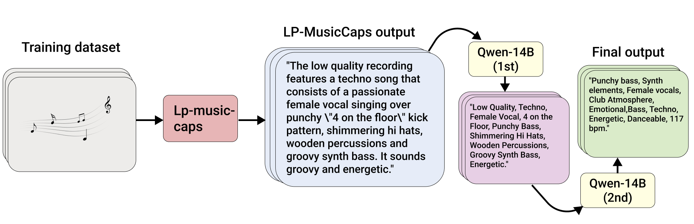
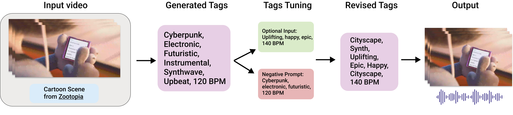

# SONIQUE: Video Background Music Generation Using Unpaired Audio-Visual Data

<div style='display:flex; gap: 0.5rem; '>
<a href='https://zxxwxyyy.github.io/templates/sonique.html'></a>
<!-- <a href=''></a> -->
<a href=''></a>
<a href='https://drive.google.com/file/d/1kRy-B82ZGvRrJq4M5ob45jOvQgp9r_Xz/view?usp=sharing'></a>
</div>

We present SONIQUE, a model for generating
background music tailored to video content. Unlike traditional
video-to-music generation approaches, which rely heavily on
paired audio-visual datasets, SONIQUE leverages unpaired data,
combining royalty-free music and independent video sources. By
utilizing large language models (LLMs) for video understanding
and converting visual descriptions into musical tags, alongside
a U-Net-based conditional diffusion model, SONIQUE enables
customizable music generation. Users can control specific aspects
of the music, such as instruments, genres, tempo, and melodies,
ensuring the generated output fits their creative vision. SONIQUE
is open-source, with a [demo](https://zxxwxyyy.github.io/templates/sonique.html) available online.


**Performance:** Executing the entire process on an NVIDIA 4090 graphics card is accomplished in under a minute. This model requires less than 14 GB GPU memory. When operated on an NVIDIA 3070 Laptop GPU with 8 GB of memory, the process duration extends to 6 minutes.

# Table of contents
<!-- - [Demo](https://github.com/zxxwxyyy/sonique?tab=readme-ov-file#demo) -->
- [Install](#install)
- [Model Checkpoint](#model-checkpoint)
- [Data Collection & Preprocessing](#data-collection--preprocessing)
- [Video-to-music-generation](#video-to-music-generation)
- [Output Tuning](#output-tuning)
- [Subjective Evaluation](#subjective-evaluation)
- [Citation](#citation)
<!-- - [Fine-tune LLM experiment](#fine-tune-llm) -->

# Install 
1. Clone this repo 
2. Create a conda environment: 
```bash
conda env create -f environment.yml
```
3. Activate the environment, navigate to the root, and run:
```bash
pip install .
```
4. After installation, you may run the demo with UI interface:
```bash
python run_gradio.py --model-config best_model.json --ckpt-path ./ckpts/stable_ep=220.ckpt
```
5. To run the demo without interface:
```bash
python inference.py --model-config best_model.json --ckpt-path ./ckpts/stable_ep=220.ckpt
```
### Additional inference flags:
- `--use-video`:
    - Use input video as condition
    - *Default*: False
- `--input-video`:
    - Path to input video 
    - *Default*: None
- `--use-init`:
    - Use melody condition
    - *Default*: False
- `init-audio`:
    - Melody condition path
    - *Default*: None
- `--llms`:
    - Selection of the name of Large Language Model to extract video description to tags
    - *Default*: Mistral 7B
- `--low-resource`:
    - If set to True, models from video -> tags stage will run in 4-bit. Only set it to False if you have enough GPU memory.
    - *Default*: True
- `--instruments`:
    - Input instrument condition
    - *Default*: None
- `--genres`:
    - Input genre condition
    - *Default*: None
- `--tempo-rate`:
    - Input tempo rate condition
    - *Default*: None
  
### Model Checkpoint
Pretrained model can be download [here](https://drive.google.com/file/d/1kRy-B82ZGvRrJq4M5ob45jOvQgp9r_Xz/view?usp=sharing). Please download, unzip, and save in the root of this project. 
```bash
sonique/
├── ckpts/
│   ├── .../
├── sonique/
├── run_gradio.py/
...
```

# Data Collection & Preprocessing



In SONIQUE, tag generation for training starts by feeding raw musical data into LP-MusicCaps to generate initial captions. These captions are
processed by Qwen 14B in two steps: first, it converts the captions into tags, then it cleans the data by removing any incorrect or misleading tags (e.g.,
”Low Quality”). This results in a clean set of tags for training.
<!-- See [here](./data_preprocessing/README.md) for details. -->

# Video-to-music-generation
SONIQUE is a multi-model tool leveraging on [stable_audio_tools](https://github.com/Stability-AI/stable-audio-tools), [Video_LLaMA](https://github.com/DAMO-NLP-SG/Video-LLaMA), and popular LLMs from Huggingface. 

Video description is extracted from the input video. We use [Video_LLaMA](https://github.com/DAMO-NLP-SG/Video-LLaMA) to extract video description from the video. Then it will be pass to LLMs to converted them into tags that describe the background music. For the LLMs currently support: 
- Mistrial 7B (default)
- Qwen 14B
- Gemma 7B (You will need to get authenticate from [Google](https://huggingface.co/google/gemma-7b-it))

# Output Tuning


Users can then fine-tune the music generation by providing additional prompts or
specifying negative prompts. The final output is background music that matches both the video and user preferences.

# Subjective Evaluation 


We generate a [demo](https://zxxwxyyy.github.io/templates/sonique.html) with seven examples using SONIQUE. These generated videos were evaluated
by a group of 38 individuals, including of artists with video
editing backgrounds and music technology students. 

Overall, 75% of users rated the generated audio as somewhat, very, or perfectly related to the video, with ”perfectly
related” being the most common rating. This positive feedback highlights SONIQUE’s effectiveness in producing audio that
aligns well with video content. However, 25% of users found
the audio to have little or no relation to the video, indicating
that the model struggles to capture the mood or sync the music
with specific video events.

<!-- # Fine-tune LLM 
Fine-tuning the LLM at the `caption to tags` stage may improve the model's performance. To see that, I run an experiment fine-tuning `mistral-7b` with paired video description and audio tags. See [here](/fine_tune_llm/README.md) for the detailed process of how this is achieved.  -->

# Citation
Please consider citing the project if it helps your research:
```
@misc{zhang2024sonique,
  title={SONIQUE: Efficient Video Background Music Generation},
  author={Zhang, Liqian},
  year={2024},
  publisher={GitHub},
  journal={GitHub repository},
  howpublished={https://github.com/zxxwxyyy/sonique},
}
```