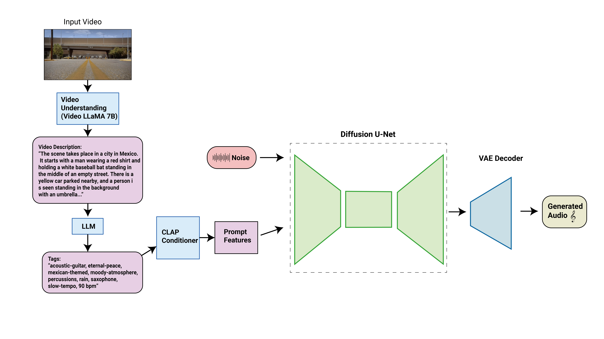

<!-- ---
title: efficient-video-bgm
app_file: run_gradio.py
sdk: gradio
sdk_version: 3.42.0
--- -->

# SONIQUE: Efficient Video Background Music Generation (In progress)

A Multi-model tool that designed to help video editors generate background music on video & tv series' transition scene. In addition, it can be used by music composers to generate conditioned music base on instruments, genres, tempo rate, and even specific melodies. 

# Table of contents
- [Demo](#demo)
- [Install](#install)
- [Model Checkpoint](#model-checkpoint)
- [Video-to-music-generation](#video-to-music-generation)
- [Text-to-music-generation](#text-to-music-generation)

# Demo
<video src="./demo_videos/assets/best_demo_v4.mp4" width="360" />

# Install 
1. Clone this repo 
2. Create a conda environment: 
```bash
conda env create -f environment.yml
```
3. Activate the environment, navigate to the root, and run:
```bash
pip install .
```
4. After installation, you may run the demo with UI interface:
```bash
python run_gradio.py --model-config best_model.json --ckpt-path ./ckpts/stable_ep=121.ckpt
```
5. To run the demo without interface:
```bash
python inference.py --model-config best_model.json --ckpt-path ./ckpts/stable_ep=121.ckpt
```
### Additional inference flags:
- `--use-video`:
    - Use input video as condition
    - *Default*: False
- `--input-video`:
    - Path to input video 
    - *Default*: None
- `--use-init`:
    - Use melody condition
    - *Default*: False
- `init-audio`:
    - Melody condition path
    - *Default*: None
- `--llms`:
    - Selection of the name of Large Language Model to extract video description to tags
    - *Default*: Mistral 7B
- `--low-resource`:
    - If set to True, models from video -> tags stage will run in 4-bit. Only set it to False if you have enough GPU memory.
    - *Default*: True
- `--instruments`:
    - Input instrument condition
    - *Default*: None
- `--genres`:
    - Input genre condition
    - *Default*: None
- `--tempo-rate`:
    - Input tempo rate condition
    - *Default*: None
  
### Model Checkpoint
Pretrained model can be download [here](). Please download, unzip, and save in the root of this project. 
```bash
efficient-video-bgm-generation/
├── ckpts/
│   ├── .../
├── run_gradio.py/
...
```

# Video-to-music-generation
SONIQUE is a multi-model tool leveraging on [stable_audio_tools](https://github.com/Stability-AI/stable-audio-tools), [Video_LLaMA](https://github.com/DAMO-NLP-SG/Video-LLaMA), and popular LLMs from Huggingface. 



Video description is extracted from the input video. I use [Video_LLaMA](https://github.com/DAMO-NLP-SG/Video-LLaMA) to extract video description from the video. Then it will be pass to LLMs to converted them into tags that describe the background music. For the LLMs currently support: 
- Mistrial 7B (default)
- Qwen 14B
- LLaMA2 13B (You will need to get authenticate from [Meta](https://huggingface.co/meta-llama/Llama-2-7b-chat-hf))
- Gemma 7B (You will need to get authenticate from [Google](https://huggingface.co/google/gemma-7b-it))

# Text-to-music-generation
Instead of using video, you may also mannually enter instruments, genres and tempo rate to generate music. 

# In-progress: 
- Finetuning the model 
- Working on the gradio demo 
- Adding support for sound effect 
- Improve the generation effiiency. 

