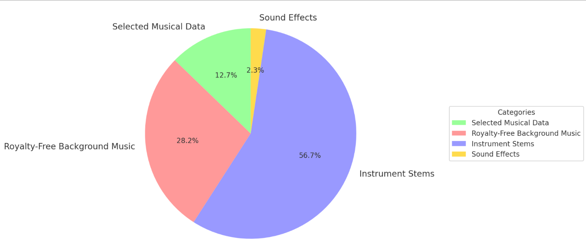

# Data collection & preprocessing for SONIQUE



The dataset used to train SONIQUE contains musical data collected without metadatas. To properly preprocess and create metadata for training, see the following steps:

## [Remove silence part from instrument stems](remove_silence.py)
This script removes the silent parts from isolated instrument stems to help the model learn more effectively.

## [Scrape royalty-free background music](scrape_royalty_free_bgm.py)
The data used to train the conditioned music generation model was royalty-free music scraped from online. This ensures that the result is more tailored to video background music. The script uses the Python library `selenium` to automatically download royalty-free background music from Pixabay.

## [Metadata creation for the training data](generate_audio_metadata.py) 
This script leverages the pretrained model [`lp-music-caps`](https://github.com/seungheondoh/lp-music-caps) to generate metadata for the scraped music above. 

## [Transfer captions to tags](convert_captions_to_tags.py.py) and [Clean up tags](summarize_tags.pyy)
The output from lp-music-caps is split into 10-second segments. The initial output is long and challenging for the model to learn. I use two functions leverage on LLM (QWEN-14B) to clean them up. The final output looks like this:
```bash
"tags": "punchy bass, synth elements, female vocals, club atmosphere, emotional, bass, techno, 	energetic, danceable, 117 bpm"
```
