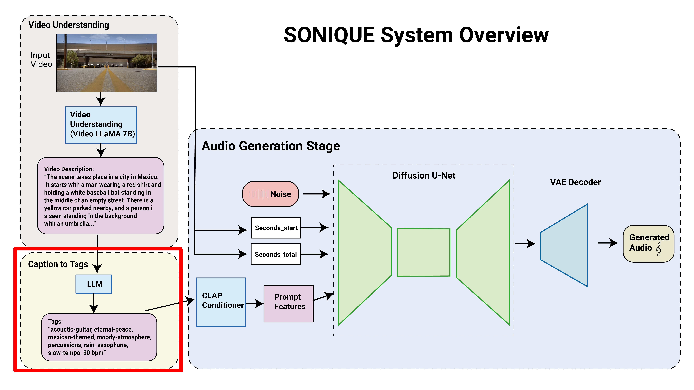
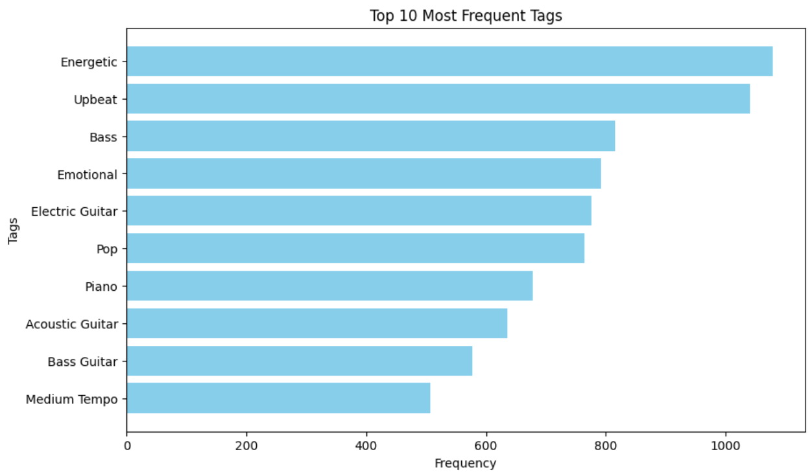

# Fine-Tune LLM for improvements



Fine-tuning a Large Language Model (LLM) on the `caption to tags` stage may enhance the performance of SONIQUE. To achieve this, I conducted experiments on fine-tuning the mistral-7b model using paired video descriptions and audio tags. The result can be found [here](https://zxxwxyyy.github.io/templates/finetune_llm.html). Below are the details of my progress:

## Collect music videos from YouTube
To fine-tune the model effectively, it's essential to use properly paired video descriptions and audio tags. The videos must be intrinsically linked to the music to ensure the paired data efficiently aids the model's learning. Music videos are ideal because they are meticulously produced to align with the music. The [`collect_mvs.py`](collect_mvs.py) shows how I collected music video data from YouTube and saved it in a `.csv` file.

## Download video and audio from csv
After collecting the data, the next step is to download the music videos and audio tracks listed in the `.csv` file. Given that the full videos and audio tracks can be quite long, I selected the first minute of each video and audio track for this project. This selection is reasonable as it typically includes the most important part of the song. The[`download.py`](download.py) showcase how I download and trim the video and audios. 

## Generates video description and audio description
Using `Video_LLaMA` and `lp-music-caps`, I generated video descriptions and audio tags, employing the same methods used in SONIQUE. The [`generate_video_des.py`](generate_video_des.py) script showcase how I processed the video descriptions from the downloaded videos. Additionally, the data preprocessing methods used to generate tags from the downloaded audio are detailed in the [`scripts`](/data_preprocessing/README.md) from my data preprocessing method.

## Create paired datasets from video description and audio tags
he next step involves preparing a properly formatted dataset from the video descriptions and audio tags. The final output generated by the [`preprocess_pair_dataset.py`](preprocess_pair_dataset.py) looks like this:
```bash
{"messages": [{"role": "system", "content": "As a music composer fluent in English, you're tasked with creating background music for video. Based on the scene described, provide only one set of tags in English that describe this background music for the video. These tags must include instruments, music genres, and tempo rate(e.g. 90 BPM). Avoid any non-English words. Please return the tags in the following JSON structure: {{'tags': ['tag1', 'tag2', 'tag3']}}"},
{"role": "user", "content": "The scene shows a group of young men standing on railroad tracks in a city. They are wearing hats and sunglasses, and there are black and white striped bags visible. There are also street signs and cars parked in the background. The scene changes throughout the video, with the men sometimes standing together and sometimes standing on the railroad tracks alone."}, 
{"role": "assistant", "content": "Piano, Groovy Bass, Drumming, Live Performance, Hip-Hop, Rap, Electric Guitar, Upbeat, Urban, Pop, Energetic, Male Vocals, Bass Guitar, Synth Lead, 136 bpm"}]}
```
This dataset is used for fine-tuning the LLM to improve its ability to generate accurate and contextually appropriate tags for video descriptions.

## Fine tune LLM
I fine-tuned `mistral-7b` for 3 epochs. The script can be found: [`ft_llm.py`](ft_llm.py). And the result can be found [here](https://zxxwxyyy.github.io/templates/finetune_llm.html). 

## Conclusion
The fine-tuned model's effectiveness appears to be constrained by the nature of the training data, leading to less variety in the generated tags. Previously, the LLM exhibited a high degree of creativity in generating diverse tags for music generation, offering a broad range of tags that enriched generation process. However, after fine-tuning, the generated tags have become more fixed, with a noticeable preference for fast-tempo music, rock, and disco genres.



The plot confirms that the dataset used for fine-tuning heavily influences the model's output, resulting in a narrow range of tags mainly associated with high-energy music genres like rock and disco. This suggests that the paired dataset's characteristics lead to the model producing repetitive and genre-specific tags, rather than the diverse range previously generated.

This experiment showcases that:
1. Dataset Composition: The lack of the diversity in the fine-tuned dataset causes the limited range of generated tags in the caption to tags stage. Having a large scale, diversity dataset could help improve the performance and the creativity of the model.Incorporating a wide array of video descriptions and audio files representing various tempos, genres, and moods is crucial.
2. Overfitting: Due to the limited number of paired samples (only 3000 pairs), the model may be overfitting during the fine-tuning process. This overfitting results in the model generating repetitive and less varied tags.
   
Even though the result not being as expected, the experience has been valuable in understanding the impact of dataset diversity and overfitting on model performance.